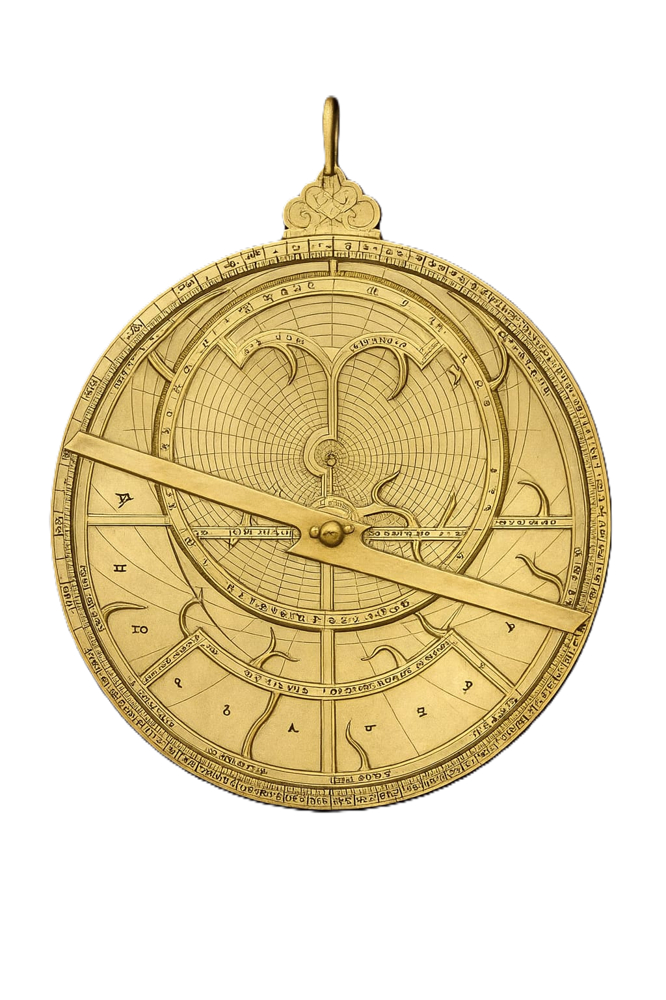

# astrolabe 

**astrolabe** is an R package that implements a novel methodology for inferring **non-linear causal relationships** among variables.  
The approach combines machine learning with information-theoretic principles, using entropy of residuals to evaluate causal directions.

---

## 🔬 Methodology

The method relies on the entropy of residuals from models fitted with **random forests**.  
The workflow is:

1. Fit random forest models for candidate causal directions.  
2. Compute the residual entropy score $H$.  
3. Perform **bootstrap–permutation testing** to assess significance. 
4. Select relevant predictors via **variable importance measures**.  

This framework is suitable for detecting non-linear causality in high-dimensional datasets, where traditional linear approaches may fail.

---

## 📐 Mathematical Details

The causal score for a model $m$ is defined as

$$
H(m) = e^{-S_{\text{knn}}(m)} ,
$$

where $S_{\text{knn}}(m)$ is a Kozachenko–Leonenko type entropy estimator  
([Kozachenko & Leonenko, 1987](https://doi.org/10.1007/BF01066342)) applied to the joint space of predictors and residuals.  

Specifically:

$$
S_{\text{knn}}(m) \approx \psi(n) - \psi(k) + \log(c_d) + \frac{d}{n} \sum_{i=1}^n \log \varepsilon_i ,
$$

with:
- $\psi$: the digamma function  
- $c_d$: volume of the $d$-dimensional unit ball  
- $\varepsilon_i$: distance to the $k$-th nearest neighbour of observation $i$  
  in the space $(X_1, X_2, ..., X_{d-1}, Y - \hat{Y})$.  

This formulation avoids sensitivity to binning choices and is well suited for continuous residuals, since entropy is estimated from the geometry of neighbour distances.

---

## 📦 Installation

### Development version (from GitHub)
```r
# install.packages("remotes") # if not already installed
remotes::install_github("astrolabe9698/astrolabe")
```


## 🧪 Example Workflow

The package is designed for flexible causal discovery on simulated or real datasets.  
Below we show a typical workflow with `astrolabe`.

```r
library(astrolabe)

# Run causal inference
scan_res <- complete_function(
  df,
  verbose = TRUE,
  n_boot = 300,
  n_perm = 50,
  plot = TRUE,
  importance_method = "neg_exp"
)

# Inspect results
print(scan_res)

